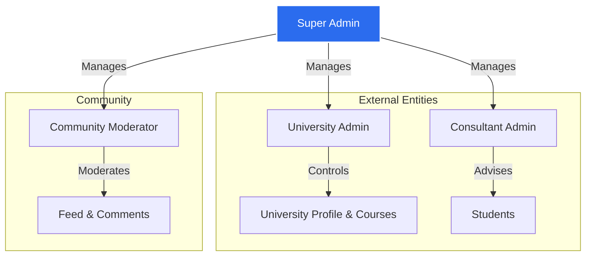

# EAOverseas Platform Documentation

## 1. Project Overview
**EAOverseas** is a comprehensive global education network platform designed to connect **Students**, **Universities**, and **Consultants**. It serves as a one-stop solution for international education, offering features ranging from university discovery and application management to loan assistance and visa preparation.

### Tech Stack
-   **Frontend Framework**: React 18+ (Vite)
-   **Language**: JavaScript (ES6+)
-   **Styling**: Tailwind CSS (v4)
-   **Routing**: React Router DOM (v7)
-   **State Management**: React Context API
-   **Icons**: Material Symbols Outlined
-   **Package Manager**: pnpm

---

## 2. Getting Started

### Prerequisites
-   Node.js (v18 or higher)
-   pnpm (`npm install -g pnpm`)

### Installation
1.  Clone the repository.
2.  Install dependencies:
    ```bash
    pnpm install
    ```
3.  Start the development server:
    ```bash
    pnpm dev
    ```
4.  Open [http://localhost:5173](http://localhost:5173) in your browser.

---

## 3. User Guide

### 3.1. Roles & Permissions
The platform caters to three primary user personas:
1.  **Students**: Seek education abroad, apply to universities, search for loans/accommodation.
2.  **Universities**: Verify their institution, manage profiles, and review applicants.
3.  **Consultants**: (Admin/Expert users) Assist students with the process.

### 3.2. Key Features by Role

#### 🎓 For Students
-   **Onboarding**: Sign up and complete a detailed profile (Basic Info, Academic History).
-   **Discovery**:
    -   **College Finder**: Search universities with advanced filters.
    -   **Course Search**: Find specific programs matching your interests.
    -   **Community Feed**: Engage with other students, see trending topics.
-   **Applications**:
    -   **Dashboard**: Track status of university applications.
    -   **Document Vault**: Securely upload and manage transcripts, IDs, and certificates.
-   **Financial Services**:
    -   **Loan Eligibility**: Check loan options, select lenders, and upload loan docs.
-   **Services**:
    -   **Visa Prep**: Guidance and document checklists for visa applications.
    -   **Accommodation**: Search for housing near chosen universities.

#### 🏛️ For Universities
-   **Verification Flow**:
    -   **Sign Up**: Register with official institution details.
    -   **Verification**: Submit proof of accreditation and contact details.
    -   **Pending Status**: A dedicated status page tracks the manual review process by EAOverseas admins.
-   **Profile Management**: Once verified, manage the university's public profile, course catalog, and media.

#### 💼 For Consultants
-   **Dashboard**: Manage student appointments.
-   **Booking System**: Set availability and conduct consultation sessions.

### 3.3. Role Hierarchy & Governance
The platform is governed by a **Super Admin** who oversees three specialized admin types. All distinct sub-admins are connected to the central system but have isolated permissions.



#### 🛡️ Super Admin Capabilities
The Super Admin is the bridge that connects and manages all other entities.

**1. Managing University Admins:**
-   **Connection**: Super Admin receives the "Verification Request" (like the pending page we built).
-   **Actions**:
    -   **Verify/Reject**: Review uploaded docs and enable the university account.
    -   **Access Control**: Can lock a university's profile if they violate terms.
    -   **Shadow Login**: Ability to view the platform *as* the university to troubleshoot.

**2. Managing Consultants:**
-   **Connection**: Consultants apply to join the platform.
-   **Actions**:
    -   **Onboarding**: Validating their certification/experience.
    -   **Assignment**: Can manually map Consultants to specific Universities or Lead Students.
    -   **Performance**: Track successful student placements and commissions.

**3. Managing Community Admins:**
-   **Connection**: These are usually internal staff or trusted users promoted by Super Admin.
-   **Actions**:
    -   Enable moderation tools for specific users.
    -   Audit logs of deleted posts or banned users.

---

## 4. Technical Documentation

### 4.1. Directory Structure
```
src/
├── assets/          # Static images (logos, illustrations)
├── components/      # Reusable UI components (Sidebar, Modals, Cards)
├── context/         # React Contexts for global state
├── layouts/         # Layout wrappers (MainLayout)
├── pages/           # Page components (routed views)
│   ├── application/ # Application-specific sub-pages
│   └── profile/     # Profile management sub-pages
├── App.jsx          # Main application component & Routing definitions
├── main.jsx         # Entry point
└── index.css        # Global styles & Tailwind directives
```

### 4.2. Core Architecture

#### Authentication (`AuthContext.jsx`)
-   **Mechanism**: Uses `localStorage` to simulate a database.
-   **Data Keys**:
    -   `eaoverseas_registered_users`: Array of all signed-up user objects.
    -   `eaoverseas_user`: Currently logged-in user session.
-   **Demo Mode**: Hardcoded admin credentials (`alex.j@example.com` / `5678`) provide a pre-filled "Demo" experience out of the box.

#### Layout System (`MainLayout.jsx`)
-   The application uses a persistent **Sidebar** navigation.
-   Content is rendered via `React Router`'s `<Outlet />`.
-   Each page component works independently to define its own Header or internal layout structure, offering flexibility.

### 4.3. Feature Modules (Deep Dive)

#### 1. University Verification (`UniversityVerification.jsx` & `UniversityPendingVerification.jsx`)
-   **Flow**: Signup -> Verification Form -> Pending Status.
-   **Pending Page**: shows a "Verification in Progress" state.
    -   **Logic**: Uses local state to manage the "Contact Support" modal.
    -   **Auto-Close**: The support modal succeeds after 1.5s (simulated) and auto-closes after 3s.
    -   **Navigation**: No back button (locked flow); Users are directed to Profile Setup.

#### 2. Student Dashboard (`HomeDashboard.jsx`)
-   Aggregates data: Application status, upcoming deadlines, community feed highlights.
-   **Data Source**: Currently uses mock data structures within the component for rapid prototyping.

#### 3. Loan Services (`Loan*.jsx`)
-   **Flow**: Eligibility Check -> Lender Selection -> Document Upload -> Timeline.
-   **Components**: Specialized cards for lender comparison (Interest rates, Processing fees).
-   **Drag & Drop**: Document upload pages support drag-and-drop file interactions.

#### 4. Community Feed (`CommunityFeed.jsx`)
-   Social-media style feed for students.
-   **Features**: Filter by topic, search posts, simulated "Like/Comment" interactions.

### 4.4. State Management
-   **AuthContext**: User session, Login/Signup logic.
-   **UserProfileContext**: Stores detailed student data (academics, preferences) across multi-step forms.
-   **SavedItemsContext**: Manages "Shortlisted" universities, courses, and accommodations globally.
-   **NotificationContext**: Handles toast notifications and alerts.

### 4.5. Routing
Defined in `App.jsx`. Uses `BrowserRouter`.
-   Public Routes: `/login`, `/signup`, `/forgot-password`
-   Protected Routes: `/`, `/profile-setup/*`, `/applications`, `/loans/*` (Wrapped in `PrivateRoute` logic checking `AuthContext`).

---

## 5. Development Guidelines
1.  **Styling**: Use Tailwind utility classes directly. Avoid custom CSS unless for complex animations.
2.  **Icons**: Use Google Material Symbols (`items-center gap-2` pattern).
3.  **Colors**: Use the defined brand palette (Primary: `#2b6cee`, Background: `#f6f6f8`).
4.  **Responsiveness**: Ensure all pages work on Mobile (`hidden md:flex`) and Desktop.
